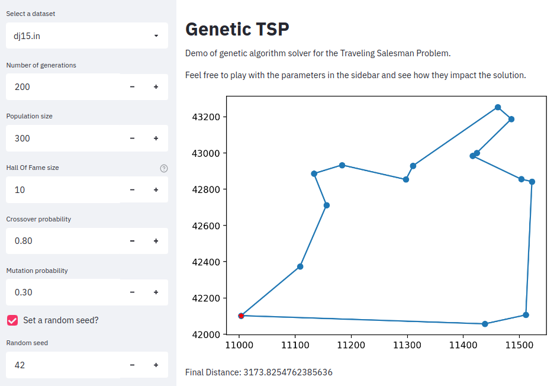

# :dna: Genetic TSP :dna:

Demo of genetic algorithm solver for the Traveling Salesman Problem.

I always wanted to try this because I find genetic algorithms really mind blowing. Also,
this is probably going to be the code for a tech talk of mine on Elo7.

Right now there is an initial working version of the app, but I'm considering a few
improvements both to the code itself and to the Streamlit app.

is instead more interested in displaying the process visually.

### Screenshot :camera:

### Run it locally :microscope:
Right now this project is not hosted anywhere so if you'd like to test it, you can do so
by setting up a Python environment and install the required packages with
`pip install -r requirements.txt` and then starting the Streamlit server with
`streamlit run app.py` and accessing `http://localhost:8501/`.